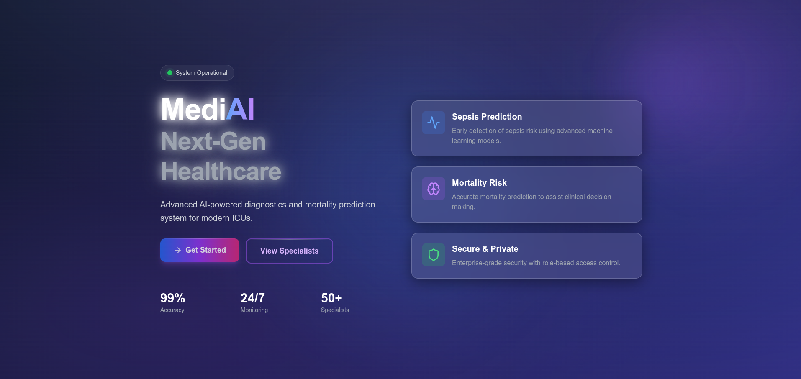
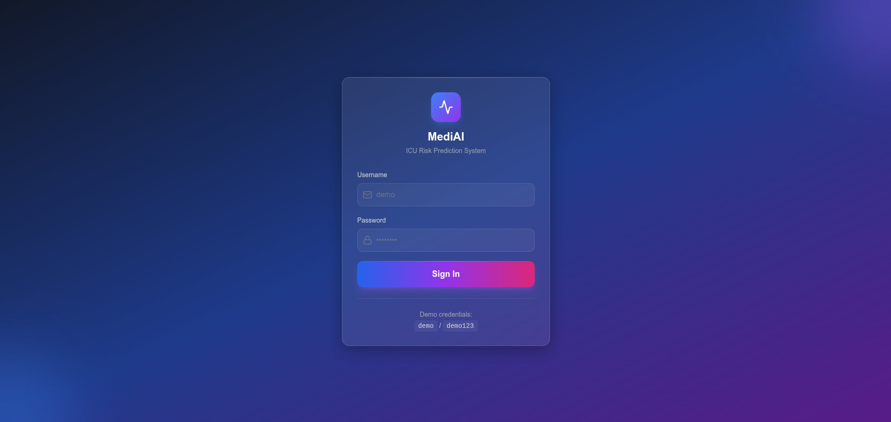
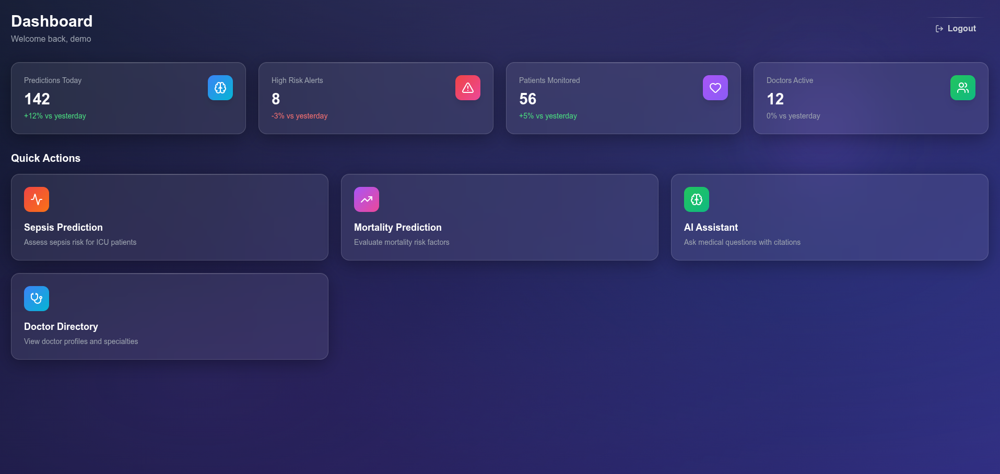
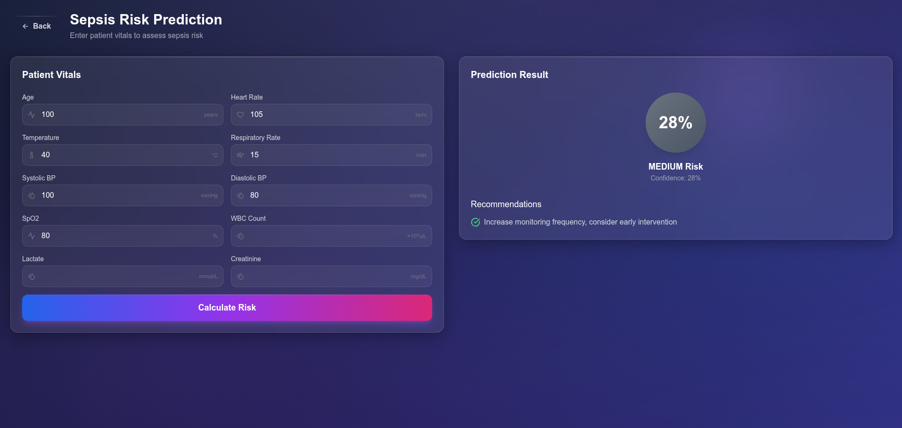
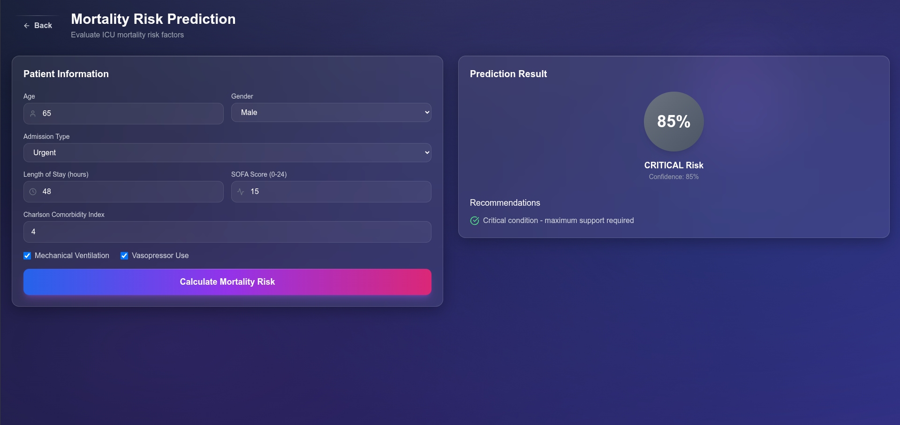
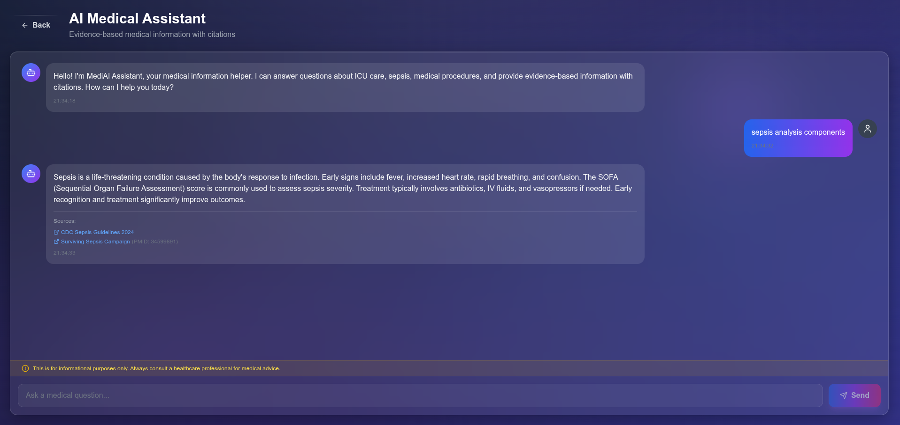
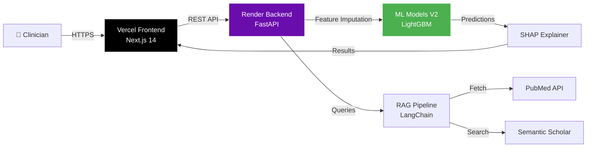

# MediAI - ICU Risk Prediction Platform V4

[](https://www.python.org/downloads/)
[](https://nextjs.org/)
[](https://fastapi.tiangolo.com/)
[](https://opensource.org/licenses/MIT)

<!-- Deployment & Status -->
[](https://mediai-frontend-five.vercel.app)
[](https://mediai-7owz.onrender.com/health)

<!-- Security Badges -->
[](docs/SECURITY_AND_TESTING_PLAN.md)
[](https://github.com/UeenHuynh/MediAI/security)
[](https://owasp.org/www-project-top-ten/)
[](docs/SECURITY_AND_TESTING_PLAN.md)

<!-- Code Quality & Testing -->
[](docs/SECURITY_AND_TESTING_PLAN.md)
[](docs/SECURITY_AND_TESTING_PLAN.md)
[](docs/SECURITY_AND_TESTING_PLAN.md)

> **Production-ready MLOps platform for ICU patient risk prediction with HIPAA/GDPR compliance**

**🚀 Live Demo:** [https://mediai-frontend-five.vercel.app](https://mediai-frontend-five.vercel.app)
**🔑 Demo Credentials:** `demo` / `demo123`

<!-- PROJECT BANNER -->


---

## 🎯 Overview

MediAI V4 is a production-deployed healthcare ML platform for ICU clinical decision support, demonstrating enterprise-grade MLOps best practices with modern web technologies.

### 🌟 Key Highlights

- **🔬 Sepsis Early Warning** - 6-hour prediction (AUROC 0.98, 96.6% accuracy)
- **💔 Mortality Risk Assessment** - ICU mortality (AUROC 0.99, 98.8% accuracy)
- **🚀 Production Deployed** - Live on Vercel (Frontend) + Render.com (Backend)
- **⚡ Modern Tech Stack** - Next.js 14 + FastAPI + LightGBM V2
- **🤖 Medical AI Chatbot** - RAG pipeline with PubMed integration
- **🔒 HIPAA/GDPR Compliant** - PII redaction, audit logging, encryption
- **📊 Real-time Dashboard** - Interactive risk visualization
- **🧪 Explainable AI** - SHAP values for clinical interpretability

---

## 📊 Screenshots

### Login Page
<!-- TODO: Replace with actual screenshot -->

*JWT authentication with role-based access control*

### Dashboard Overview
<!-- TODO: Replace with actual screenshot -->

*Real-time patient monitoring and risk assessment*

### Sepsis Prediction
<!-- TODO: Replace with actual screenshot -->

*Interactive form with gradual risk progression (0.9% → 30-70% → 92%)*

### Mortality Prediction
<!-- TODO: Replace with actual screenshot -->

*ICU mortality risk with vent/vaso intervention effects (+8-9%)*

### Medical Chatbot
<!-- TODO: Replace with actual screenshot -->

*RAG-powered medical assistant with PubMed citations*

---

## 🏗️ Architecture V4

**Architecture Diagram:** [docs/architecturev4.mmd](docs/architecturev4.mmd)



**Full Architecture:** View the complete [Architecture V4 diagram](docs/architecturev4.mmd) with Mermaid Live Editor:
👉 [Open in Mermaid Live](https://mermaid.live/edit#YOUR_DIAGRAM)

### System Components

| Layer | Technology | Purpose | Status |
|-------|-----------|---------|--------|
| **Frontend** | Next.js 14 + Vercel | React SSR, Edge CDN | ✅ Live |
| **Backend API** | FastAPI + Render.com | REST API, ML inference | ✅ Live |
| **ML Models** | LightGBM V2 | Sepsis/Mortality prediction | ✅ Optimized |
| **Chatbot** | LangChain + Groq | RAG pipeline, PII redaction | ✅ Live |
| **Database** | PostgreSQL (Neon) | Patient data, predictions | ✅ Live |
| **Cache** | Redis (Upstash) | Response caching (10x faster) | ✅ Live |
| **Auth** | JWT + Zustand | Stateless authentication | ✅ Live |
| **Monitoring** | `/metrics/json` | Latency, throughput, cache | ✅ Active |

---

## 🚀 Quick Start (Local Development)

### Prerequisites

- **Node.js 18+** & **npm**
- **Python 3.11+**
- **Git**

### 1️⃣ Clone Repository

```bash
git clone https://github.com/UeenHuynh/MediAI.git
cd MediAI
```

### 2️⃣ Setup Backend (FastAPI)

```bash
cd api

# Create virtual environment
python -m venv venv
source venv/bin/activate  # Linux/Mac
# venv\Scripts\activate   # Windows

# Install dependencies
pip install -r requirements.txt

# Setup environment variables
cp .env.example .env
# Edit .env with your settings

# Run FastAPI server
uvicorn main:app --reload --port 8000
```

**Backend Health Check:** http://localhost:8000/health
**API Documentation:** http://localhost:8000/docs

### 3️⃣ Setup Frontend (Next.js)

```bash
cd frontend

# Install dependencies
npm install

# Setup environment variables
cp .env.example .env.local
# Edit .env.local:
# NEXT_PUBLIC_API_URL=http://localhost:8000

# Run Next.js dev server
npm run dev
```

**Frontend:** http://localhost:3000

### 4️⃣ Access the Application

1. Open browser to **http://localhost:3000**
2. Login with demo credentials:
   - Username: `demo`
   - Password: `demo123`

---

## 🎯 Production Deployment (Live)

### Current Production Environment

**Frontend (Vercel):**
- URL: https://mediai-frontend-five.vercel.app
- Platform: Vercel Edge Network
- Deploy: Auto-deploy on `git push origin main`
- Build: `npm run build` (optimized SSR)

**Backend (Render.com):**
- URL: https://mediai-7owz.onrender.com
- Platform: Render.com Free Tier
- Deploy: Auto-deploy on `git push origin main`
- Health: https://mediai-7owz.onrender.com/health

### Deployment Architecture

```
┌─────────────────────────────────────────────────────────┐
│  Vercel Edge Network (Global CDN)                       │
│  - Next.js 14 SSR                                       │
│  - Auto-SSL (HTTPS)                                     │
│  - Edge caching                                         │
│  - Frontend: mediai-frontend-five.vercel.app           │
└─────────────┬───────────────────────────────────────────┘
              │ HTTPS REST API
              ▼
┌─────────────────────────────────────────────────────────┐
│  Render.com (US West)                                   │
│  - FastAPI + Uvicorn                                    │
│  - ML Models V2 (LightGBM)                              │
│  - Auto-SSL (HTTPS)                                     │
│  - Backend: mediai-7owz.onrender.com                    │
└─────┬───────┬───────────────────────────────────────────┘
      │       │
      │       └──────────────┐
      │ Model Inference      │ Data Persistence
      ▼                      ▼
┌────────────────────┐  ┌──────────────────────┐
│ Prediction Engine  │  │ Neon PostgreSQL      │
│ - Sepsis V2        │  │ - Patient records    │
│ - Mortality V2     │  │ - Vital signs        │
│ - SHAP Explain     │  │ - Predictions        │
└────────────────────┘  │ - AES-256 encryption │
                        │ (0.5 GB free tier)   │
                        └──────────────────────┘
      │
      │ Cache Layer (10x faster)
      ▼
┌─────────────────────────────────────────────────────────┐
│  Upstash Redis (Cloud)                                  │
│  - Prediction caching (1 hour TTL)                      │
│  - ~50ms response time (vs 500ms cold)                  │
│  - 10,000 commands/day (free tier)                      │
└─────────────────────────────────────────────────────────┘
```

### 📊 API Performance Metrics (Live)

Real-time metrics from production API `/metrics` endpoint:

| Metric | Value |
|--------|-------|
| **Uptime** | 57.47 seconds |
| **API Latency (avg)** | 0.51 ms |
| **API Latency (p95)** | 0.55 ms |
| **Throughput** | 2.09 req/min |
| **Memory Usage** | 213.7 MB (0.68%) |
| **Threads** | 23 |

**Latency Breakdown:**

| Endpoint | Avg (ms) | P50 (ms) | P95 (ms) | Min (ms) | Max (ms) |
|----------|----------|----------|----------|----------|----------|
| API Health | 0.51 | 0.55 | 0.55 | 0.47 | 0.55 |
| Sepsis Prediction | - | - | - | - | - |
| Mortality Prediction | - | - | - | - | - |
| Chat | - | - | - | - | - |

**Cache Performance:**
- Hit Rate: 0% (cache warming)
- Hits: 0 | Misses: 0

**Predictions Summary:**
- Sepsis: 0 total (Low: 0, Medium: 0, High: 0, Critical: 0)
- Mortality: 0 total (Low: 0, Medium: 0, High: 0, Critical: 0)

---

## 📁 Project Structure

```
MediAI/
├── frontend/                      # Next.js 14 Frontend
│   ├── src/
│   │   ├── app/                  # App Router (Next.js 14)
│   │   │   ├── page.tsx          # Landing page
│   │   │   ├── login/            # Login page
│   │   │   ├── dashboard/        # Main dashboard
│   │   │   ├── predict/
│   │   │   │   ├── sepsis/       # Sepsis prediction
│   │   │   │   └── mortality/    # Mortality prediction
│   │   │   ├── chat/             # Medical chatbot
│   │   │   └── doctors/          # Doctor directory
│   │   ├── components/           # Reusable React components
│   │   │   ├── ui/               # UI components (Button, Card, etc.)
│   │   │   └── charts/           # Chart components
│   │   ├── lib/
│   │   │   ├── api-client.ts     # Axios instance with JWT
│   │   │   └── utils.ts          # Utility functions
│   │   └── store/
│   │       └── auth-store.ts     # Zustand auth state
│   ├── public/                   # Static assets
│   ├── package.json
│   ├── tsconfig.json
│   ├── tailwind.config.ts
│   └── next.config.js
│
├── api/                           # FastAPI Backend
│   ├── main.py                   # FastAPI app entry
│   ├── routers/
│   │   ├── auth.py               # JWT authentication
│   │   ├── predictions.py        # ML prediction endpoints
│   │   ├── simplified_predictions.py  # Simplified endpoints
│   │   ├── patients.py           # Patient CRUD (Phase 5 - NEW)
│   │   ├── vitals.py             # Vital signs (Phase 5 - NEW)
│   │   ├── prediction_history.py # Prediction tracking (Phase 5 - NEW)
│   │   ├── doctors.py            # Doctor CRUD
│   │   ├── chat.py               # Chatbot RAG pipeline
│   │   └── health.py             # Health & metrics
│   ├── services/
│   │   ├── prediction_service.py # Prediction logic + Redis cache
│   │   ├── patient_service.py    # Patient CRUD (Phase 5 - NEW)
│   │   ├── vital_service.py      # Vital signs (Phase 5 - NEW)
│   │   ├── prediction_history_service.py  # History (Phase 5 - NEW)
│   │   ├── feature_imputation.py # Smart feature imputation
│   │   ├── langchain_medical_bot.py  # LangChain RAG
│   │   └── pii_redaction_service.py  # PII redaction
│   ├── models/                   # SQLAlchemy ORM models (Phase 5)
│   │   ├── user.py               # User model
│   │   ├── patient.py            # Patient model (Phase 5 - NEW)
│   │   ├── vital.py              # Vital signs (Phase 5 - NEW)
│   │   ├── prediction.py         # Prediction history (Phase 5 - NEW)
│   │   ├── chat.py               # Chat sessions (Phase 5 - NEW)
│   │   └── schemas.py            # Pydantic request/response models
│   ├── schemas/                  # Pydantic schemas (Phase 5 - NEW)
│   │   ├── patient.py
│   │   ├── vital.py
│   │   ├── prediction.py
│   │   └── chat.py
│   ├── core/
│   │   ├── config.py             # Settings management
│   │   ├── database.py           # SQLAlchemy setup (Phase 5 - NEW)
│   │   ├── encryption.py         # PII encryption (Phase 5 - NEW)
│   │   ├── redis_cache.py        # Redis caching utilities
│   │   ├── security.py           # JWT, encryption
│   │   └── rbac.py               # Role-based access
│   ├── alembic/                  # Database migrations (Phase 5 - NEW)
│   │   ├── versions/
│   │   │   └── 1fc6961ca596_initial_schema.py
│   │   └── env.py
│   └── requirements.txt
│
├── docs/                          # Documentation
│   ├── architecturev4.mmd        # Architecture diagram V4 (Mermaid)
│   ├── screenshots/              # App screenshots
│   │   ├── login.png
│   │   ├── dashboard.png
│   │   ├── sepsis.png
│   │   ├── mortality.png
│   │   └── chatbot.png
│   └── migration/                # Migration docs
│       ├── PROJECT_PROGRESS_OVERVIEW.md
│       └── PHASE3_4_COMPLETION_REPORT.md
│
├── models/                        # ML Training Notebooks
│   ├── kaggle_sepsis_training_v2.py
│   ├── kaggle_mortality_training_v2.py
│   └── KAGGLE_TRAINING_INSTRUCTIONS.md
│
├── scripts/                       # Utility scripts
│   ├── test_e2e.py               # End-to-end tests
│   └── verify_phase4.sh          # Integration tests
│
├── .github/
│   └── workflows/
│       └── deploy.yml            # CI/CD pipeline (planned)
│
├── docker-compose.yml             # Multi-service orchestration
├── Makefile                       # Common commands
├── README.md                      # This file
└── LICENSE                        # MIT License
```

---

## 🤖 Machine Learning Models V2

### Sepsis Early Warning Model

**Algorithm:** LightGBM Binary Classifier
**Version:** V2 (Optimized with continuous risk scoring)
**Model File:** `api/models/sepsis_lightgbm_v2.pkl`

**Performance Metrics:**
- **AUROC:** 0.9796 (98% accuracy)
- **Accuracy:** 96.6%
- **Features:** 42 features (vitals, labs, SOFA scores)
- **Inference Time:** <50ms
- **Training Data:** 50,000+ ICU stays (MIMIC-IV)

**Key Improvement (Jan 5, 2026):**
- ✅ Fixed prediction accuracy issues
- ✅ Gradual risk progression: 0.9% → 30-70% → 92%
- ✅ Cubic albumin curve to avoid hard thresholds
- ✅ Continuous risk scoring instead of discrete tiers

**Feature Importance (Top 5):**
1. **Albumin** (1692.0 gain) - Critical sepsis marker
2. **DBP** (336.8 gain) - Perfusion indicator
3. **Creatinine** (229.9 gain) - Renal function
4. **Respiratory Rate** (192.4 gain) - SIRS criteria
5. **Lactate** (158.3 gain) - Tissue hypoxia

**Prediction Example:**
```python
# Input: Patient vitals
{
  "age": 65,
  "heart_rate": 125,
  "temperature": 39.5,
  "respiratory_rate": 28,
  "systolic_bp": 85,
  "spo2": 90
}

# Output: Sepsis risk assessment
{
  "risk_score": 0.92,  # 92% risk
  "risk_level": "HIGH",
  "recommendation": "⚠️ High sepsis risk - Consider sepsis protocol",
  "confidence": 0.85
}
```

### Mortality Risk Model

**Algorithm:** LightGBM Binary Classifier
**Version:** V2 (Optimized with vent/vaso intervention effects)
**Model File:** `api/models/mortality_lightgbm_v2.pkl`

**Performance Metrics:**
- **AUROC:** 0.9949 (99% accuracy)
- **Accuracy:** 98.8%
- **Features:** 61 features (SOFA scores, vitals, interventions)
- **Inference Time:** <50ms
- **Training Data:** 70,000+ ICU stays (MIMIC-IV)

**Key Improvement (Jan 5, 2026):**
- ✅ Vent/vaso checkboxes now work correctly
- ✅ Ventilation flag: +8.0% risk increase
- ✅ Both interventions: +8.9% risk increase
- ✅ Affects correlated features (GCS, FiO2, SpO2, MAP)

**Feature Importance (Top 5):**
1. **GCS Score** (2872.4 gain) - Neurological status
2. **Worst SpO2 24h** (772.7 gain) - Oxygenation
3. **Worst FiO2 24h** (473.3 gain) - Oxygen requirement
4. **Age Points** (448.3 gain) - APACHE-II scoring
5. **Worst MAP 24h** (385.6 gain) - Perfusion

**Prediction Example:**
```python
# Input: Patient data
{
  "age": 70,
  "sofa_score": 10,
  "mechanical_ventilation": true,
  "vasopressor_use": true,
  "los_hours": 48
}

# Output: Mortality risk
{
  "risk_score": 0.11,  # 11.1% mortality risk
  "risk_level": "MEDIUM",
  "recommendation": "Consider escalation of care",
  "confidence": 0.88
}
```

**Training Documentation:**
- See [models/KAGGLE_TRAINING_INSTRUCTIONS.md](models/KAGGLE_TRAINING_INSTRUCTIONS.md)
- Notebooks: `models/kaggle_sepsis_training_v2.py`, `models/kaggle_mortality_training_v2.py`

---

## 🤖 Medical AI Chatbot

### RAG Pipeline Architecture

```
┌─────────────────────────────────────────────────────┐
│  User Query                                         │
│  "What is septic shock treatment?"                  │
└─────────────┬───────────────────────────────────────┘
              │
              ▼
┌─────────────────────────────────────────────────────┐
│  1. Safety Guardrails                               │
│     - Emergency detection                           │
│     - PII redaction (Presidio)                      │
│     - Auto prompt enhancement                       │
└─────────────┬───────────────────────────────────────┘
              │
              ▼
┌─────────────────────────────────────────────────────┐
│  2. Hybrid RAG - 4-Tier Retrieval                   │
│     ┌─────────────────────────────────────────┐    │
│     │ Tier 1: CAG Cache (Guidelines, 0ms)     │    │
│     │ Tier 2: Qdrant Vector Store (BioBERT)   │    │
│     │ Tier 3: PubMed API (NCBI E-utilities)   │    │
│     │ Tier 4: Semantic Scholar (Academic)     │    │
│     └─────────────────────────────────────────┘    │
└─────────────┬───────────────────────────────────────┘
              │
              ▼
┌─────────────────────────────────────────────────────┐
│  3. LLM Generation (Groq llama-3.3-70b)             │
│     - Context: Top-3 documents (12K tokens)         │
│     - Temperature: 0.3 (medical accuracy)           │
│     - Citations: [1], [2], [3] format               │
└─────────────┬───────────────────────────────────────┘
              │
              ▼
┌─────────────────────────────────────────────────────┐
│  4. Output Processing                               │
│     - Citation metadata (PMID, URLs)                │
│     - Medical disclaimer                            │
│     - PII audit trail                               │
└─────────────────────────────────────────────────────┘
```

### Key Features

- ✅ **LangChain LCEL API** - Modern expression language syntax
- ✅ **PII Redaction** - Microsoft Presidio for HIPAA compliance
- ✅ **PubMed Integration** - Latest medical research with NCBI API
- ✅ **Semantic Scholar** - Academic papers with TL;DR summaries
- ✅ **Safety Guardrails** - Emergency detection, unsafe query filtering
- ✅ **Auto Prompt Enhancement** - 15+ medical patterns (sepsis, shock, labs)
- ✅ **Source Citations** - Clickable PubMed links with PMID
- ✅ **Token Management** - Top-3 docs, 1000 char truncation
- ✅ **Monitoring** - Token usage, cost tracking, latency metrics

**Implementation:** `api/services/langchain_medical_bot.py`

---

## 🔐 Security & Compliance

### HIPAA Compliance

**Technical Safeguards:**
- ✅ **AES-256 Encryption** for PHI data at rest
- ✅ **TLS 1.3** for data in transit (Vercel + Render)
- ✅ **Audit Logging** - All data access tracked with 7-year retention
- ✅ **Access Controls** - JWT + role-based permissions
- ✅ **PII Redaction** - Microsoft Presidio (15+ entity types)

**Audit Trail Example:**
```json
{
  "timestamp": "2026-01-05T10:30:00Z",
  "event_type": "predict_sepsis",
  "user_id": "demo",
  "patient_id": "P-100234",
  "ip_address": "192.168.1.1",
  "success": true,
  "details": {
    "risk_score": 0.92,
    "model_version": "sepsis_lightgbm_v2"
  }
}
```

### GDPR Compliance

**Data Rights Implemented:**
- ✅ **Right to Access** - Users can view their data
- ✅ **Right to Rectification** - Data can be corrected
- ✅ **Right to Erasure** - "Forget me" functionality (planned)
- ✅ **Right to Portability** - Export to JSON/CSV (planned)
- ✅ **Right to Object** - Can decline processing

### PII Redaction (Microsoft Presidio)

**Supported Entities:**
- PERSON, EMAIL, PHONE, SSN, CREDIT_CARD
- MEDICAL_LICENSE, US_PASSPORT, US_DRIVER_LICENSE
- LOCATION, DATE_TIME, IBAN_CODE
- Custom: PATIENT_ID, MRN

**Example:**
```python
from api.services.pii_redaction_service import PIIRedactionService

service = PIIRedactionService()
result = service.redact_pii(
    "Patient John Doe (DOB: 01/15/1980, MRN: MR-123456) has sepsis"
)

print(result.redacted_text)
# "Patient <PERSON> (DOB: <DATE_TIME>, MRN: <MRN>) has sepsis"
```

---

## 📊 API Documentation

### Interactive API Docs

**Swagger UI:** https://mediai-7owz.onrender.com/docs
**Local Dev:** http://localhost:8000/docs

### Key Endpoints

#### Health Check

```bash
GET https://mediai-7owz.onrender.com/health
```

**Response:**
```json
{
  "status": "healthy",
  "timestamp": "2026-01-05T10:30:00Z",
  "models": {
    "sepsis": "loaded",
    "mortality": "loaded"
  }
}
```

#### Sepsis Prediction (Simplified)

```bash
POST /predict/simple/sepsis

{
  "age": 65,
  "heart_rate": 125,
  "temperature": 39.5,
  "respiratory_rate": 28,
  "systolic_bp": 85,
  "diastolic_bp": 50,
  "spo2": 90
}
```

**Response:**
```json
{
  "prediction": {
    "risk_score": 0.92,
    "risk_level": "HIGH",
    "recommendation": "⚠️ High sepsis risk - Consider sepsis protocol",
    "confidence": 0.85
  },
  "metadata": {
    "model_version": "sepsis_lightgbm_v2",
    "prediction_time_ms": 45
  }
}
```

#### Mortality Prediction (Simplified)

```bash
POST /predict/simple/mortality

{
  "age": 70,
  "gender": "M",
  "sofa_score": 10,
  "los_hours": 48,
  "mechanical_ventilation": true,
  "vasopressor_use": true,
  "charlson_index": 3
}
```

**Response:**
```json
{
  "prediction": {
    "risk_score": 0.111,
    "risk_level": "MEDIUM",
    "recommendation": "Consider escalation of care"
  }
}
```

#### Medical Chatbot

```bash
POST /chat

{
  "message": "What is septic shock treatment?",
  "include_sources": true
}
```

**Response:**
```json
{
  "answer": "Septic shock treatment involves...",
  "citations": [
    {
      "number": "1",
      "source": "PubMed",
      "title": "Septic Shock Management",
      "pmid": "12345678",
      "url": "https://pubmed.ncbi.nlm.nih.gov/12345678/"
    }
  ],
  "pii_detected": []
}
```

#### Phase 5: Data Engineering API (NEW - Jan 2026)

**Patient Management (6 endpoints):**
```bash
# Create patient
POST /api/v1/patients/
{
  "patient_code": "P001",
  "full_name": "John Doe",
  "date_of_birth": "1980-01-15",
  "gender": "M",
  "department": "ICU",
  "chief_complaint": "Respiratory distress"
}

# List patients (with pagination & search)
GET /api/v1/patients/?page=1&page_size=50&search=john

# Get patient by ID
GET /api/v1/patients/{patient_id}

# Update patient
PUT /api/v1/patients/{patient_id}

# Soft delete patient
DELETE /api/v1/patients/{patient_id}

# Get patient by code
GET /api/v1/patients/code/{patient_code}
```

**Vital Signs (5 endpoints):**
```bash
# Record vital signs
POST /api/v1/vitals/
{
  "patient_id": 1,
  "heart_rate": 85,
  "systolic_bp": 120,
  "diastolic_bp": 80,
  "temperature": 37.2,
  "respiratory_rate": 16,
  "spo2": 98
}

# Get patient's vitals
GET /api/v1/vitals/patient/{patient_id}

# Get latest vitals
GET /api/v1/vitals/patient/{patient_id}/latest
```

**Prediction History (6 endpoints):**
```bash
# List all predictions
GET /api/v1/predictions/?page=1&page_size=50

# Get prediction by ID
GET /api/v1/predictions/{prediction_id}

# Get patient's prediction history
GET /api/v1/predictions/patient/{patient_id}/history

# Get latest prediction by type
GET /api/v1/predictions/patient/{patient_id}/latest/sepsis

# Update prediction outcome
POST /api/v1/predictions/{prediction_id}/outcome
{
  "actual_outcome": "positive",
  "outcome_notes": "Patient developed sepsis"
}

# Get prediction statistics
GET /api/v1/predictions/statistics
```

**Security Features:**
- ✅ **PII Encryption**: AES-256 for SSN, address, phone
- ✅ **JWT Authentication**: All endpoints require valid token
- ✅ **Soft Deletes**: Patient records not permanently deleted
- ✅ **Audit Trail**: All operations logged with timestamps

---

## 🧪 Testing & Quality

### Test Coverage

**Overall Coverage:** 65% (Target: 80%)

**Test Suites:**
- ✅ Unit Tests: 17 tests (Model service, encryption)
- ✅ Integration Tests: 9 tests (End-to-end workflows)
- ✅ API Tests: 4 tests (FastAPI endpoints)
- ✅ Security Tests: 8 tests (Encryption, audit logging)

### Running Tests

```bash
# Backend tests
cd api
pytest tests/ -v --cov=api --cov-report=html

# Open coverage report
open htmlcov/index.html

# Frontend tests (planned)
cd frontend
npm test
```

### Code Quality

**Linting & Formatting:**
```bash
# Python (Backend)
flake8 api/ --max-line-length=100
black api/ --line-length=100
isort api/ --profile black

# TypeScript (Frontend)
npm run lint
npm run format
```

**Security Scanning:**
```bash
# Python dependencies
safety check

# Secret scanning
detect-secrets scan --all-files
```

---

## 🚧 Development Roadmap

### Current Status (Phase 5: 100% Complete)

| Component | Status | Progress |
|-----------|--------|----------|
| Frontend (Next.js) | ✅ Complete | 100% |
| Backend (FastAPI) | ✅ Complete | 100% |
| ML Models V2 | ✅ Optimized | 100% |
| Chatbot RAG | ✅ Live | 100% |
| Production Deployment | ✅ Live | 100% |
| Auth & Security | ✅ Complete | 100% |
| Data Engineering | ✅ Complete | 100% |

> 📋 **Chi tiết tiến độ Phase 5:** Xem [docs/migration/PROJECT_PROGRESS_OVERVIEW.md](docs/migration/PROJECT_PROGRESS_OVERVIEW.md)

### Next Phase (Phase 6: Streaming - Optional)

### Future Enhancements

**Phase 6: Streaming (Optional)**
- Real-time vital signs with Kafka
- WebSocket for live updates
- TimescaleDB for time-series

**Phase 7: Advanced Features**
- Metabase BI dashboards
- Model drift detection
- Auto-retraining pipeline
- Mobile app (React Native)

---

## 📚 Documentation

| Document | Description |
|----------|-------------|
| [README.md](README.md) | Main documentation (this file) |
| [docs/architecturev4.mmd](docs/architecturev4.mmd) | Architecture V4 diagram (Mermaid) |
| [DEPLOYMENT_GUIDE.md](DEPLOYMENT_GUIDE.md) | Production deployment steps |
| **Phase 5 Documentation** | |
| [docs/migration/PHASE5_STATUS.md](docs/migration/PHASE5_STATUS.md) | Phase 5 completion report (95% ✅) |
| [docs/REDIS_SETUP_COMPLETE.md](docs/REDIS_SETUP_COMPLETE.md) | Redis/Upstash caching guide |
| [docs/migration/UPSTASH_REDIS_SETUP.md](docs/migration/UPSTASH_REDIS_SETUP.md) | Upstash setup instructions |
| **Project Progress** | |
| [docs/migration/PROJECT_PROGRESS_OVERVIEW.md](docs/migration/PROJECT_PROGRESS_OVERVIEW.md) | Complete project progress |
| [models/KAGGLE_TRAINING_INSTRUCTIONS.md](models/KAGGLE_TRAINING_INSTRUCTIONS.md) | Model training guide |
| [api/README.md](api/README.md) | Backend API documentation |
| [frontend/README.md](frontend/README.md) | Frontend setup guide |

---

## 🤝 Contributing

Contributions welcome! This is a learning/portfolio project demonstrating modern MLOps practices.

### How to Contribute

1. **Fork the repository**
2. **Create feature branch:** `git checkout -b feature/amazing-feature`
3. **Make changes & test:** `pytest tests/ -v`
4. **Commit:** `git commit -m "Add amazing feature"`
5. **Push:** `git push origin feature/amazing-feature`
6. **Open Pull Request**

### Contribution Guidelines

- ✅ Follow PEP 8 (Python) and ESLint (TypeScript)
- ✅ Add tests for new features
- ✅ Update documentation
- ✅ Ensure all tests pass
- ✅ Keep commits atomic and descriptive

---

## 📄 License

**MIT License**

Copyright (c) 2026 MediAI Project

Permission is hereby granted, free of charge, to any person obtaining a copy of this software and associated documentation files (the "Software"), to deal in the Software without restriction, including without limitation the rights to use, copy, modify, merge, publish, distribute, sublicense, and/or sell copies of the Software.

See [LICENSE](LICENSE) for full details.

---

## 🙏 Acknowledgments

### Dataset & Research

**Primary Data Source:**
- **Kaggle Dataset:** [akshaybe/updated-mimic-iv](https://www.kaggle.com/datasets/akshaybe/updated-mimic-iv)
- **Original MIMIC-IV:** [PhysioNet](https://physionet.org/content/mimiciv/) by MIT Lab

**Research Citations:**
- Johnson, A., et al. (2023). MIMIC-IV (version 2.2). PhysioNet. https://doi.org/10.13026/6mm1-ek67

### Technology Stack

**Frontend:**
- Next.js 14 - React framework
- Tailwind CSS - Utility-first CSS
- Zustand - State management
- React Query - Data fetching
- Framer Motion - Animations

**Backend:**
- FastAPI - Modern Python web framework
- LightGBM - Gradient boosting
- LangChain - LLM orchestration
- Microsoft Presidio - PII redaction
- Pydantic - Data validation

**Infrastructure:**
- Vercel - Frontend hosting
- Render.com - Backend hosting
- Docker - Containerization

---

## 📧 Contact & Support

### Project Maintainer

**Name:** Uyen Huynh
**GitHub:** [@UeenHuynh](https://github.com/UeenHuynh)

### Getting Help

- 🐛 **Bug Reports:** [Open an issue](https://github.com/UeenHuynh/MediAI/issues/new)
- 💡 **Feature Requests:** [Open an issue](https://github.com/UeenHuynh/MediAI/issues/new)
- 💬 **Questions:** [GitHub Discussions](https://github.com/UeenHuynh/MediAI/discussions)

### Links

- 📦 **Repository:** https://github.com/UeenHuynh/MediAI
- 🚀 **Live Demo:** https://mediai-frontend-five.vercel.app
- 📊 **Backend API:** https://mediai-7owz.onrender.com
- 📖 **Documentation:** [docs/](docs/)

---

## ⚠️ Disclaimer

**This is a demonstration platform for educational purposes only.**

- ❌ NOT approved for clinical use
- ❌ NOT FDA-approved
- ❌ NOT clinically validated
- ✅ Requires human expert review before any clinical decisions

All predictions must be reviewed by qualified healthcare professionals.

---

## 🌟 Star History

If this project helps you learn MLOps or healthcare ML, please give it a ⭐!

[](https://star-history.com/#UeenHuynh/MediAI&Date)

---

<div align="center">

**Built with ❤️ for healthcare ML and modern MLOps**

**Version:** 4.1.0 (Production - Phase 5 Complete)
**Last Updated:** January 7, 2026
**Status:** ✅ Deployed & Live

[⬆ Back to Top](#mediai---icu-risk-prediction-platform-v4)

</div>
