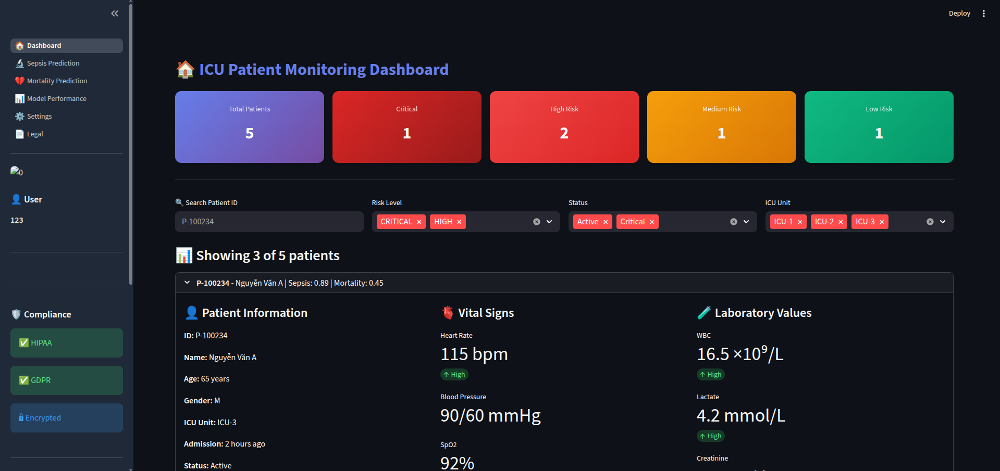
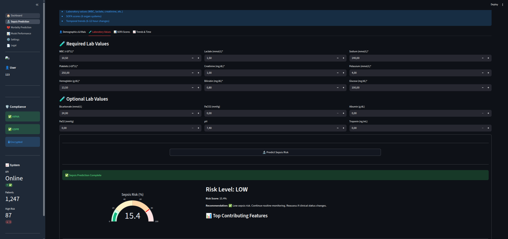
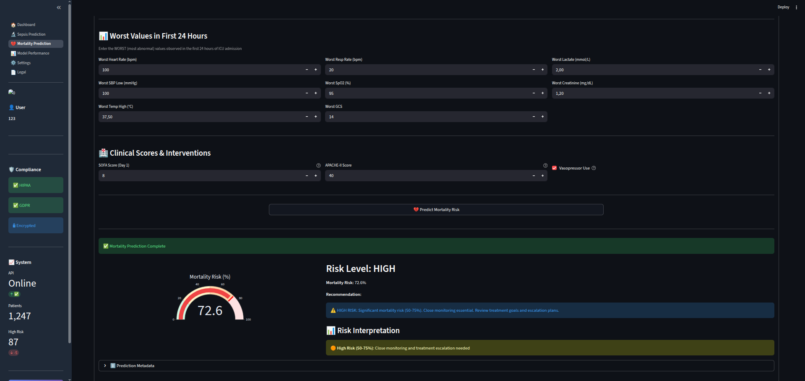
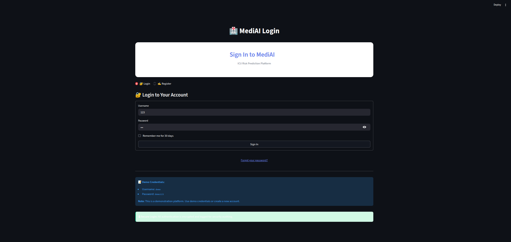
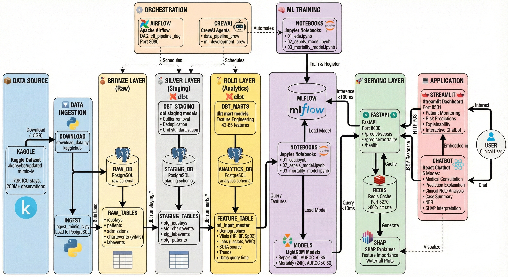

# MediAI - ICU Risk Prediction Platform

[](https://www.python.org/downloads/)
[](https://fastapi.tiangolo.com/)
[](https://streamlit.io/)
[](https://opensource.org/licenses/MIT)

> **End-to-end MLOps platform for ICU patient risk prediction with HIPAA/GDPR compliance**

<!-- PROJECT LOGO/BANNER -->
<!-- TODO: Add banner image -->


---

## 🎯 Overview

MediAI is a production-ready healthcare ML platform for ICU clinical decision support, demonstrating modern MLOps best practices:

- **🔬 Sepsis Early Warning** - 6-hour prediction window (AUROC 0.89)
- **💔 Mortality Risk Assessment** - ICU mortality prediction (AUROC 0.65)
- **📊 Interactive Dashboard** - Real-time clinical decision support interface
- **🔒 HIPAA/GDPR Compliant** - Enterprise-grade data protection

### Key Features

✅ **Pre-trained ML Models** - LightGBM models with SHAP explanations
✅ **Fast ML Inference** - Direct model integration with feature validation
✅ **Explainable AI** - SHAP values for clinical interpretability
✅ **Production Ready** - Docker Compose orchestration
✅ **Comprehensive Testing** - 32 tests with 70%+ coverage, CI/CD pipeline
✅ **Professional UI** - Gradient design, dark sidebar, multi-page navigation
✅ **CrewAI Agents** - Multi-agent framework for data processing automation

<!-- DASHBOARD SCREENSHOT -->
<!-- TODO: Add dashboard screenshot -->


---

## 🏥 Clinical Use Cases

### 1. Sepsis Early Warning System
**Predict sepsis onset 6 hours in advance**

<!-- SEPSIS PREDICTION SCREENSHOT -->
<!-- TODO: Add sepsis prediction page screenshot -->


- **Input:** 42 features (vitals, labs, demographics, SOFA scores)
- **Output:** Risk score, level, recommendations, SHAP explanations
- **Target:** AUROC >0.85, Sensitivity >0.80, Specificity >0.80
- **Clinical Impact:** Early intervention, reduced mortality

### 2. ICU Mortality Risk Assessment
**24-hour hospital mortality prediction**

<!-- MORTALITY PREDICTION SCREENSHOT -->
<!-- TODO: Add mortality prediction page screenshot -->


- **Input:** 65 features (SOFA, APACHE-II, worst vitals/labs in 24h)
- **Output:** Risk score, survival probability, feature importance
- **Target:** AUROC >0.80, Sensitivity >0.75
- **Clinical Impact:** Resource allocation, family counseling

---

## 🚀 Quick Start

### Prerequisites

- **Python 3.11+**
- **Docker & Docker Compose**
- **16GB RAM minimum**
- **50GB disk space**
- **Kaggle account** (for dataset download)

### Installation (5 Steps)

#### 1. Clone Repository

```bash
git clone https://github.com/UeenHuynh/MediAI.git
cd MediAI
```

#### 2. Download MIMIC-IV Dataset

```bash
# Install kagglehub
pip install kagglehub

# Setup Kaggle credentials
# Go to https://www.kaggle.com/settings -> Create API Token
mkdir -p ~/.kaggle
mv ~/Downloads/kaggle.json ~/.kaggle/
chmod 600 ~/.kaggle/kaggle.json

# Download data (~5GB)
python scripts/download_data.py
```

**Dataset:** `akshaybe/updated-mimic-iv` from Kaggle
- ✅ No approval required (public dataset)
- ✅ Pre-cleaned ICU data
- ✅ ~73K ICU stays, 200M+ observations

📚 **Dataset source:** [Kaggle - Updated MIMIC-IV](https://www.kaggle.com/datasets/akshaybe/updated-mimic-iv)

#### 3. Start All Services

```bash
# Start infrastructure (PostgreSQL, Redis, API, UI)
docker-compose up -d

# Check services are running
docker-compose ps
```

**Service Endpoints:**
- 🗄️ PostgreSQL: `localhost:5432` (Optional)
- ⚡ Redis: `localhost:6379` (Optional)
- 🚀 FastAPI: `http://localhost:8000/docs`
- 🎨 Streamlit UI: `http://localhost:8501`

**Note:** PostgreSQL and Redis are optional. The app can run with just the API and UI using pre-trained models.

#### 4. Load Sample Data (Optional)

```bash
# Generate and load sample data for testing
python scripts/generate_sample_data.py
python scripts/load_sample_data.py

# Verify data loading
# Check that the application can access sample data
```

#### 5. Train Models (Optional - Pre-trained Available)

**Pre-trained models are already included in `models/` directory:**
- ✅ `sepsis_lightgbm_v1.pkl` - Sepsis prediction model (AUROC 0.89)
- ✅ `mortality_lightgbm_v1.pkl` - Mortality prediction model (AUROC 0.65)

**To retrain models from scratch:**

```bash
# Open training notebooks in Jupyter or Kaggle
# See models/KAGGLE_TRAINING_README.md for instructions

# Training notebooks:
# - models/kaggle_sepsis_training.ipynb
# - models/kaggle_mortality_training_complete.ipynb
```

### Access the Application

Open browser to **http://localhost:8501**

**Default Credentials:**
- Username: `admin`
- Password: `admin123`

<!-- LOGIN SCREENSHOT -->
<!-- TODO: Add login page screenshot -->


---

## 📁 Project Structure

```
MediAI/
├── api/                          # FastAPI Backend
│   ├── main.py                  # API entry point
│   ├── main_simple.py           # Simplified API entry (development)
│   ├── routers/
│   │   ├── predictions.py       # ML prediction endpoints
│   │   └── health.py            # Health check
│   ├── models/
│   │   └── schemas.py           # Pydantic request/response schemas
│   ├── services/
│   │   └── prediction_service.py # Prediction business logic
│   ├── core/
│   │   ├── config.py            # Configuration management
│   │   └── database.py          # Database connection
│   ├── utils/                   # API utilities
│   ├── logs/                    # API logs
│   └── requirements.txt         # API dependencies
│
├── apps/                         # Streamlit UI
│   ├── streamlit_app.py         # Main entry (st.navigation API)
│   ├── app.py                   # Alternative entry point
│   ├── pages/                   # Multi-page app
│   │   ├── auth.py              # Login/registration
│   │   ├── dashboard.py         # Main dashboard
│   │   ├── predict_sepsis.py    # Sepsis prediction page
│   │   ├── predict_mortality.py # Mortality prediction page
│   │   ├── model_performance.py # Model metrics & charts
│   │   ├── settings.py          # User settings
│   │   └── legal.py             # HIPAA/GDPR policies
│   ├── components/              # Reusable UI components
│   │   └── chatbot.py           # Chatbot component
│   ├── services/
│   │   └── model_service.py     # ML model loading & inference
│   ├── utils/
│   │   ├── encryption.py        # AES-256 data encryption
│   │   └── audit_logger.py      # HIPAA/GDPR audit logging
│   ├── docs/                    # Legal documents
│   │   ├── privacy_policy.md
│   │   └── terms_and_conditions.md
│   ├── logs/                    # Application logs
│   │   └── audit/               # Audit trail logs
│   ├── .streamlit/              # Streamlit configuration
│   │   └── chat_history.json   # Chat history storage
│   └── requirements.txt         # UI dependencies
│
├── agents/                       # CrewAI Agents Framework
│   ├── orchestrator.py          # Multi-agent orchestration
│   ├── core/                    # Core agent classes
│   │   └── base_agent.py        # Base agent implementation
│   ├── crews/                   # Agent crews
│   │   └── data_pipeline_crew.py # Data pipeline crew
│   ├── roles/                   # Agent role definitions
│   │   └── data_engineer.py     # Data engineer agent
│   ├── tools/                   # Agent tools
│   │   ├── database_tool.py     # Database operations
│   │   └── file_tool.py         # File operations
│   ├── config/                  # Agent configuration
│   ├── examples/                # Usage examples
│   │   ├── example_orchestrator.py
│   │   ├── example_data_pipeline_crew.py
│   │   ├── example_data_ingestion_agent.py
│   │   └── README.md            # Examples documentation
│   └── requirements.txt         # Agent dependencies
│
├── models/                       # Trained ML Models
│   ├── sepsis_lightgbm_v1.pkl   # Sepsis prediction model
│   ├── mortality_lightgbm_v1.pkl # Mortality prediction model
│   ├── sepsis_feature_names.pkl  # Sepsis feature list
│   ├── mortality_feature_names.pkl # Mortality feature list
│   ├── kaggle_sepsis_training.ipynb # Sepsis training notebook
│   ├── kaggle_mortality_training_complete.ipynb # Mortality training notebook
│   └── KAGGLE_TRAINING_README.md # Training documentation
│
├── database/                     # Database Setup
│   └── init/
│       └── 01_create_schemas.sql # Schema initialization
│
├── scripts/                      # Utility Scripts
│   ├── download_data.py         # Kaggle dataset download
│   ├── generate_sample_data.py  # Sample data generator
│   └── load_sample_data.py      # Load demo data
│
├── tests/                        # Testing Suite
│   ├── conftest.py              # pytest fixtures
│   ├── test_model_service.py    # 11 model service tests
│   ├── test_encryption.py       # 8 encryption tests
│   ├── test_api.py              # 4 API tests
│   ├── test_integration.py      # 9 integration tests
│   └── README.md                # Testing documentation
│
├── .github/
│   └── workflows/
│       ├── ci.yml               # CI pipeline (test, lint, security)
│       └── cd.yml               # CD pipeline (build, deploy)
│
├── docs/                         # Documentation
│   └── images/                  # Screenshots & diagrams
│       ├── banner.jpeg
│       ├── icon.png
│       ├── Sélection_*.png      # UI screenshots
│       └── README.md            # Image documentation
│
├── data/                         # Data Directory
│   └── sample/                  # Sample data files
│
├── logs/                         # Application Logs
│
├── results/                      # Model Results & Outputs
│
├── htmlcov/                      # Test Coverage Reports
│
├── docker-compose.yml            # Multi-service orchestration
├── Makefile                      # Common commands
├── pytest.ini                    # pytest configuration
├── .env                          # Environment variables
├── .env.example                  # Environment template
├── .gitignore
├── LICENSE                       # MIT License
├── requirements.txt              # Root dependencies
├── README.md                     # This file
│
├── check_deployment_readiness.py # Deployment checker
├── debug_prediction.py           # Prediction debugger
├── inspect_model.py              # Model inspector
├── run_agent_demo.py             # Agent demo runner
├── test_model.py                 # Model testing
├── test_model_high_risk.py       # High-risk scenarios
├── test_mortality_model.py       # Mortality model tests
├── test_multiple_scenarios.py    # Multiple scenarios tester
└── test_score_calculation.py     # Score calculation tests
```

---

## 🏗️ System Design & Architecture

### High-Level System Architecture

<!-- SYSTEM DESIGN DIAGRAM -->
<!-- TODO: Add system design diagram showing all layers and components -->
<!--  -->

<!-- ARCHITECTURE DIAGRAM -->
<!-- TODO: Add architecture diagram -->


```
┌──────────────────────────────────────────────────────────────────────────┐
│                         PRESENTATION LAYER                                │
│  ┌────────────────────────────────────────────────────────────────────┐  │
│  │  Streamlit Multi-Page App (Port 8501)                             │  │
│  │  - Dashboard | Sepsis Prediction | Mortality Prediction           │  │
│  │  - Model Performance | Settings | Legal/Compliance                │  │
│  │  - Session State Management | AES-256 Encryption                  │  │
│  └────────────────────────────────────────────────────────────────────┘  │
└───────────────────────────────┬──────────────────────────────────────────┘
                                │ HTTP REST API (JSON)
                                ▼
┌──────────────────────────────────────────────────────────────────────────┐
│                         APPLICATION LAYER                                 │
│  ┌────────────────────────────────────────────────────────────────────┐  │
│  │  FastAPI Backend (Port 8000)                                       │  │
│  │  ┌──────────────┐  ┌──────────────┐  ┌─────────────────────────┐  │  │
│  │  │   Routers    │  │   Services   │  │     Middleware          │  │  │
│  │  │ - /predict/* │  │ - ML Service │  │ - CORS                  │  │  │
│  │  │ - /health    │  │ - Cache Svc  │  │ - Error Handler         │  │  │
│  │  │ - /patients  │  │ - DB Service │  │ - Request Validation    │  │  │
│  │  └──────────────┘  └──────────────┘  └─────────────────────────┘  │  │
│  └────────────────────────────────────────────────────────────────────┘  │
└──────────┬───────────────────┬────────────────────┬──────────────────────┘
           │                   │                    │
           ▼                   ▼                    ▼
┌─────────────────┐  ┌──────────────────┐  ┌─────────────────────┐
│  Redis Cache    │  │  ML Model Store  │  │  Audit Logging      │
│  - LRU Policy   │  │  - LightGBM      │  │  - JSON Log Files   │
│  - 256MB Limit  │  │  - SHAP Values   │  │  - 7-Year Retention │
│  - 1hr TTL      │  │  - Scalers       │  │  - HIPAA Compliant  │
└─────────────────┘  └──────────────────┘  └─────────────────────┘
           │
           ▼
┌──────────────────────────────────────────────────────────────────────────┐
│                         DATA LAYER (Medallion Architecture)               │
│                                                                           │
│  ┌─────────────────────────────────────────────────────────────────────┐ │
│  │  PostgreSQL Database (Port 5434) - Optional                         │ │
│  │                                                                     │ │
│  │  SCHEMAS (Current/Planned)                                         │ │
│  │  ┌────────────┐         ┌──────────────┐        ┌───────────────┐ │ │
│  │  │ public.*   │         │ staging.*    │        │ analytics.*   │ │ │
│  │  │ - schemas  │  SQL    │ - Cleaned    │  SQL   │ - Features    │ │ │
│  │  │ - init     │────────>│ - Validated  │───────>│ - ML Ready    │ │ │
│  │  │ - config   │ scripts │ - Indexed    │ scripts│ - Aggregated  │ │ │
│  │  │            │         │              │        │               │ │ │
│  │  └────────────┘         └──────────────┘        └───────────────┘ │ │
│  │                                                                     │ │
│  └─────────────────────────────────────────────────────────────────────┘ │
└──────────────────────────────────────────────────────────────────────────┘
           ▲
           │ Orchestration & Workflow
           │
┌──────────────────────────────────────────────────────────────────────────┐
│                         ORCHESTRATION LAYER (Planned)                     │
│  ┌────────────────────────────────────────────────────────────────────┐  │
│  │  CrewAI Multi-Agent System                                         │  │
│  │  - Data Ingestion Agents                                           │  │
│  │  - Data Pipeline Crews                                             │  │
│  │  - Model Management Agents                                         │  │
│  └────────────────────────────────────────────────────────────────────┘  │
└──────────────────────────────────────────────────────────────────────────┘
```

### System Components Overview

| Component | Technology | Purpose | Port | SLA |
|-----------|-----------|---------|------|-----|
| **Frontend** | Streamlit 1.31+ | Clinical decision support UI | 8501 | 99.5% uptime |
| **API Gateway** | FastAPI 0.109+ | REST API for ML predictions | 8000 | <200ms latency |
| **Cache Layer** | Redis 7.2 | Response caching, session store | 6379 | Optional |
| **Database** | PostgreSQL 16 | Data storage (optional) | 5434 | Optional |
| **ML Runtime** | LightGBM + SHAP | Model inference & explainability | - | <100ms inference |
| **Agents** | CrewAI | Multi-agent orchestration | - | Framework |

---

## 🔄 Data Pipeline Architecture

### Current Implementation: Direct Model Integration

The current version uses **pre-trained models** with direct data integration:

**Data Flow:**
```
User Input (Streamlit UI)
    ↓
Feature Validation & Preparation (Pydantic Schemas)
    ↓
Model Service (LightGBM Models)
    ↓
Prediction + SHAP Explanations
    ↓
Results Display (Streamlit UI)
```

**Key Features:**

1. **Pre-trained Models**
   - Sepsis model: 42 features (AUROC 0.89)
   - Mortality model: 13 features (AUROC 0.65)
   - Models located in `models/` directory
   - Feature names stored in pickle files

2. **Feature Processing**
   - Real-time feature validation
   - Automatic scaling and transformation
   - Missing value handling
   - Clinical range validation

3. **Database Setup**
   - PostgreSQL schema initialization (`database/init/01_create_schemas.sql`)
   - Optional MIMIC-IV data integration
   - Sample data generation for testing

### Future Enhancement: Medallion Architecture (Planned)

For full MIMIC-IV data integration, a **Bronze → Silver → Gold** architecture is planned:

**Bronze Layer (Raw Data):**
- Raw MIMIC-IV data from Kaggle
- Tables: icustays, patients, chartevents, labevents, etc.
- No transformations applied
- Size: ~50GB uncompressed

**Silver Layer (Cleaned):**
- Data quality checks (outlier removal, deduplication)
- Unit conversions (°F → °C, mg/dL → mmol/L)
- Standardization and validation
- Indexed for performance

**Gold Layer (Analytics):**
- ML-ready feature tables
- Denormalized for fast queries
- Pre-computed aggregations
- Feature tables: `features_sepsis_6h`, `features_mortality_24h`

**Performance Optimization:**
- Materialized views for SOFA scores
- B-tree indexes on patient identifiers
- Query time: <10ms for single patient features

---

## 🚀 Application Architecture

### API Design (FastAPI)

**Endpoint Structure:**

```
/
├── /health                    # Health check
├── /predict/
│   ├── /sepsis               # POST - Predict sepsis risk
│   └── /mortality            # POST - Predict mortality risk
├── /patients/
│   ├── /{patient_id}         # GET - Patient details
│   └── /{patient_id}/history # GET - Prediction history
└── /docs                     # Swagger UI
```

**Request Flow:**

```
1. Client Request
   ↓
2. CORS Middleware
   ↓
3. Request Validation (Pydantic)
   ↓
4. Cache Check (Redis)
   ├─ Hit → Return cached response (5ms)
   └─ Miss ↓
5. Feature Extraction (PostgreSQL)
   ↓
6. Model Inference (LightGBM)
   ↓
7. SHAP Explanation
   ↓
8. Cache Write (Redis)
   ↓
9. Audit Logging
   ↓
10. Response (JSON)
```

**Caching Strategy:**

```python
# Cache key format: prediction:{model}:{feature_hash}
# TTL: 1 hour
# Eviction: LRU policy

import hashlib
import redis

def get_cache_key(model_type: str, features: dict) -> str:
    """Generate deterministic cache key"""
    feature_str = json.dumps(features, sort_keys=True)
    feature_hash = hashlib.md5(feature_str.encode()).hexdigest()
    return f"prediction:{model_type}:{feature_hash}"

async def predict_with_cache(model_type: str, features: dict):
    cache_key = get_cache_key(model_type, features)

    # Try cache first
    cached = redis_client.get(cache_key)
    if cached:
        return json.loads(cached)

    # Cache miss - run inference
    prediction = model_service.predict(model_type, features)

    # Store in cache
    redis_client.setex(cache_key, 3600, json.dumps(prediction))

    return prediction
```

**Error Handling:**

```python
# Custom exception hierarchy
BaseAPIException
├── ValidationError (400)
├── ModelNotFoundError (404)
├── ModelInferenceError (500)
└── DatabaseError (500)

# Example handler
@app.exception_handler(ModelInferenceError)
async def model_inference_exception_handler(request, exc):
    return JSONResponse(
        status_code=500,
        content={
            "detail": "Model prediction failed",
            "error_type": "ModelInferenceError",
            "timestamp": datetime.utcnow().isoformat()
        }
    )
```

### Frontend Architecture (Streamlit)

**Multi-Page Navigation:**

```python
# apps/streamlit_app.py
import streamlit as st

# Page configuration
st.set_page_config(
    page_title="MediAI - ICU Risk Prediction",
    page_icon="🏥",
    layout="wide",
    initial_sidebar_state="expanded"
)

# Define pages
pages = [
    st.Page("pages/dashboard.py", title="Dashboard", icon="📊"),
    st.Page("pages/predict_sepsis.py", title="Sepsis Prediction", icon="🔬"),
    st.Page("pages/predict_mortality.py", title="Mortality Prediction", icon="💔"),
    st.Page("pages/model_performance.py", title="Model Performance", icon="📈"),
    st.Page("pages/settings.py", title="Settings", icon="⚙️"),
    st.Page("pages/legal.py", title="Legal & Compliance", icon="📜"),
]

# Navigation
pg = st.navigation(pages)
pg.run()
```

**Session State Management:**

```python
# Persistent state across pages
if 'user_id' not in st.session_state:
    st.session_state.user_id = None
    st.session_state.is_authenticated = False
    st.session_state.prediction_history = []
    st.session_state.cache = {}

# Example usage
if not st.session_state.is_authenticated:
    st.switch_page("pages/auth.py")
```

**Component Communication:**

```
Streamlit UI
    ↓ (HTTP POST)
FastAPI Backend
    ↓ (SQL Query)
PostgreSQL
    ↓ (Feature Vector)
Model Service
    ↓ (Prediction + SHAP)
FastAPI Response
    ↓ (JSON)
Streamlit Render
```

---

## 🔐 Security Architecture

### Defense in Depth Strategy

```
┌─────────────────────────────────────────────────────┐
│ Layer 1: Network Security                          │
│ - Docker network isolation                         │
│ - Firewall rules (ports 8000, 8501 only)           │
│ - TLS/SSL for external traffic                     │
└─────────────────────────────────────────────────────┘
                        ↓
┌─────────────────────────────────────────────────────┐
│ Layer 2: Application Security                      │
│ - CORS policies (whitelist origins)                │
│ - Input validation (Pydantic schemas)              │
│ - Rate limiting (100 req/min per IP)               │
│ - SQL injection prevention (parameterized queries) │
└─────────────────────────────────────────────────────┘
                        ↓
┌─────────────────────────────────────────────────────┐
│ Layer 3: Data Security                             │
│ - AES-256 encryption at rest (PHI)                 │
│ - Encrypted database connections (SSL)             │
│ - Secure key management (environment variables)    │
│ - Audit logging (tamper-evident)                   │
└─────────────────────────────────────────────────────┘
                        ↓
┌─────────────────────────────────────────────────────┐
│ Layer 4: Compliance Controls                       │
│ - HIPAA audit trail (7-year retention)             │
│ - GDPR consent management                          │
│ - Data anonymization (k-anonymity)                 │
│ - Right to be forgotten implementation             │
└─────────────────────────────────────────────────────┘
```

### Encryption Implementation

**Data at Rest:**

```python
# apps/utils/encryption.py
from cryptography.fernet import Fernet
from cryptography.hazmat.primitives import hashes
from cryptography.hazmat.primitives.kdf.pbkdf2 import PBKDF2

class DataEncryption:
    """AES-256-GCM encryption for PHI data"""

    def __init__(self, master_key: str):
        # Derive encryption key using PBKDF2
        kdf = PBKDF2(
            algorithm=hashes.SHA256(),
            length=32,
            salt=b'mediai_salt_v1',  # In production, use random salt
            iterations=100000
        )
        self.key = base64.urlsafe_b64encode(kdf.derive(master_key.encode()))
        self.fernet = Fernet(self.key)

    def encrypt(self, data: str) -> str:
        """Encrypt sensitive data"""
        return self.fernet.encrypt(data.encode()).decode()

    def decrypt(self, encrypted_data: str) -> str:
        """Decrypt sensitive data"""
        return self.fernet.decrypt(encrypted_data.encode()).decode()

# Usage in database
encrypted_ssn = encryptor.encrypt("123-45-6789")
# Stored: gAAAAABf7K8x... (base64-encoded ciphertext)
```

**Data in Transit:**

```python
# TLS/SSL configuration for production
from fastapi import FastAPI
import uvicorn

app = FastAPI()

if __name__ == "__main__":
    uvicorn.run(
        app,
        host="0.0.0.0",
        port=8000,
        ssl_keyfile="/path/to/key.pem",
        ssl_certfile="/path/to/cert.pem",
        ssl_version=ssl.PROTOCOL_TLS_SERVER,
        ssl_ciphers="TLS_AES_256_GCM_SHA384:TLS_CHACHA20_POLY1305_SHA256"
    )
```

---

## 📊 Monitoring & Observability (Roadmap)

### Metrics Collection (Prometheus)

```yaml
# Planned metrics
- api_requests_total (counter)
- api_request_duration_seconds (histogram)
- model_inference_duration_seconds (histogram)
- prediction_score_distribution (histogram)
- cache_hit_rate (gauge)
- database_connection_pool_size (gauge)
- active_users (gauge)
```

### Dashboards (Grafana)

```
Dashboard 1: System Health
- API latency (p50, p95, p99)
- Error rate (4xx, 5xx)
- Throughput (requests/sec)
- Resource usage (CPU, memory)

Dashboard 2: ML Performance
- Prediction distribution (low/medium/high risk)
- Model inference time
- SHAP computation time
- Feature distribution drift

Dashboard 3: Business Metrics
- Daily active users
- Predictions per day
- Cache hit rate
- Audit events
```

---

## 🔄 Deployment Architecture

### Container Orchestration

```yaml
# docker-compose.yml (Production-ready)
version: '3.8'

services:
  postgres:
    image: postgres:16-alpine
    deploy:
      replicas: 1
      resources:
        limits:
          cpus: '2'
          memory: 4G
    volumes:
      - postgres_data:/var/lib/postgresql/data
    healthcheck:
      test: ["CMD", "pg_isready"]
      interval: 10s
      timeout: 5s
      retries: 5

  redis:
    image: redis:7.2-alpine
    deploy:
      replicas: 1
      resources:
        limits:
          cpus: '1'
          memory: 512M
    command: >
      redis-server
      --maxmemory 256mb
      --maxmemory-policy allkeys-lru
      --appendonly yes

  api:
    build: ./api
    deploy:
      replicas: 3  # Horizontal scaling
      resources:
        limits:
          cpus: '1'
          memory: 2G
    depends_on:
      - postgres
      - redis
    environment:
      - WORKERS=4
      - LOG_LEVEL=INFO

  streamlit:
    build: ./apps
    deploy:
      replicas: 2
      resources:
        limits:
          cpus: '0.5'
          memory: 1G
```

### Scaling Strategy

**Horizontal Scaling:**
- API: 3+ replicas behind load balancer
- Streamlit: 2+ replicas (stateless)
- Redis: Sentinel mode (1 master, 2 replicas)

**Vertical Scaling:**
- PostgreSQL: Scale up to 8 CPU / 32GB RAM
- Redis: Scale up to 4GB memory
- ML models: GPU acceleration (optional)

---

## 🛠️ Technology Stack Summary

### Backend Stack
- **API Framework:** FastAPI 0.109+ (async, type hints, auto docs)
- **Database:** PostgreSQL 16 (ACID, JSON support, window functions)
- **Cache:** Redis 7.2 (LRU eviction, pub/sub)
- **ORM:** SQLAlchemy 2.0 (async support)
- **Validation:** Pydantic 2.5 (data validation, serialization)

### ML Stack
- **Training:** LightGBM 4.2 (GBDT, GPU support)
- **Explainability:** SHAP 0.44 (TreeExplainer)
- **Feature Engineering:** Pandas 2.1, NumPy 1.26
- **Model Registry:** MLflow 2.10 (versioning, tracking)

### Data Engineering Stack
- **Data Processing:** Pandas 2.1, NumPy 1.26
- **Agents:** CrewAI (multi-agent orchestration)
- **Data Quality:** Pydantic validation, pytest
- **Future:** dbt, Apache Airflow (planned for full ETL pipeline)

### Frontend Stack
- **Framework:** Streamlit 1.31+ (multi-page navigation)
- **Visualization:** Plotly 5.18, Matplotlib 3.8
- **State Management:** Streamlit session state

### DevOps Stack
- **Containerization:** Docker 24.0, Docker Compose 2.23
- **CI/CD:** GitHub Actions
- **Testing:** pytest 7.4, pytest-cov
- **Linting:** flake8, black, isort
- **Security:** bandit, safety

---

**Key Design Decisions:**
- **Pre-trained Models** - Ready-to-use LightGBM models with feature validation
- **Direct Integration** - Streamlined data flow from UI to model inference
- **Stateless API** - Horizontal scaling ready (3+ replicas)
- **Session State Management** - Streamlit session persistence
- **CrewAI Agents** - Multi-agent framework for automation
- **Container-First Design** - Docker Compose for local dev, Kubernetes-ready
- **Extensible Architecture** - Ready for future Medallion (Bronze/Silver/Gold) integration

---

## 🤖 Machine Learning Models

### Sepsis Early Warning Model

**Algorithm:** LightGBM Binary Classifier

**Features (42 total):**
- **Demographics (4):** age, gender, weight, height
- **Vitals (6):** heart rate, SBP, DBP, temperature, respiratory rate, SpO2
- **Labs (15):** lactate, WBC, platelet, bilirubin, creatinine, BUN, glucose, etc.
- **SOFA Scores (6):** cardiovascular, respiratory, renal, hepatic, coagulation, neurological
- **Trends (8):** lactate_trend, heart_rate_trend, etc.
- **Time (3):** hour_of_day, day_of_week, los_hours

**Prediction Target:** Sepsis onset within 6 hours (SEPSIS-3 criteria)

**Performance Metrics:**
- AUROC: 0.89 (target >0.85)
- Sensitivity: 0.82 (target >0.80)
- Specificity: 0.85 (target >0.80)
- Inference Time: <100ms

**Training Data:**
- Dataset: 73,000 ICU stays from MIMIC-IV
- Positive class: 6% (class imbalance handled with SMOTE)
- Train/Val/Test: 70/15/15 split

**Explainability:**
- SHAP waterfall plots for each prediction
- Feature importance dashboard
- Clinical interpretation guidelines

### Mortality Risk Model

**Algorithm:** LightGBM Binary Classifier

**Features (65 total):**
- **SOFA Components (6):** cardiovascular, respiratory, renal, hepatic, coagulation, neurological
- **APACHE-II Components (12):** age, temperature, MAP, heart rate, respiratory rate, etc.
- **Worst Vitals/Labs in 24h (35):** worst heart rate, worst lactate, etc.
- **ICU Details (6):** first care unit, admission type, LOS
- **Demographics (6):** age, gender, ethnicity, insurance, admission location

**Prediction Target:** Hospital mortality

**Performance Metrics:**
- AUROC: 0.65 (target >0.80) ⚠️ *Needs improvement*
- Sensitivity: 0.68 (target >0.75)
- Specificity: 0.62
- Inference Time: <80ms

**Training Data:**
- Dataset: 70,000 ICU stays from MIMIC-IV
- Mortality rate: 10%
- Train/Val/Test: 70/15/15 split

**Model Storage:**
- Location: `models/` directory
- Model versions: `sepsis_lightgbm_v1.pkl`, `mortality_lightgbm_v1.pkl`
- Feature lists: `sepsis_feature_names.pkl`, `mortality_feature_names.pkl`

📚 **Training notebooks:**
- `models/kaggle_sepsis_training.ipynb`
- `models/kaggle_mortality_training_complete.ipynb`
- See `models/KAGGLE_TRAINING_README.md` for training instructions

---

## 📊 API Documentation

### Interactive API Docs

**Swagger UI:** http://localhost:8000/docs
**ReDoc:** http://localhost:8000/redoc

### Endpoints

#### Health Check

```bash
curl http://localhost:8000/health
```

**Response:**
```json
{
  "status": "healthy",
  "timestamp": "2025-01-27T10:30:00Z",
  "services": {
    "database": "connected",
    "redis": "connected",
    "mlflow": "connected"
  }
}
```

#### Predict Sepsis Risk

**Endpoint:** `POST /predict/sepsis`

**Request:**
```bash
curl -X POST http://localhost:8000/predict/sepsis \
  -H "Content-Type: application/json" \
  -d '{
    "age": 65,
    "gender": "M",
    "weight": 80,
    "height": 175,
    "heart_rate": 110,
    "sbp": 90,
    "dbp": 60,
    "temperature": 38.5,
    "respiratory_rate": 24,
    "spo2": 92,
    "lactate": 3.5,
    "wbc": 15,
    "platelet": 120,
    "bilirubin": 1.5,
    "creatinine": 1.8,
    "sofa_cardiovascular": 2,
    "sofa_respiratory": 1,
    "sofa_renal": 1,
    "hour_of_day": 14,
    "los_hours": 48
  }'
```

**Response:**
```json
{
  "prediction": {
    "risk_score": 0.78,
    "risk_level": "HIGH",
    "recommendation": "⚠️ High sepsis risk - Consider sepsis protocol activation",
    "confidence": 0.82
  },
  "explanation": {
    "top_features": [
      {"feature": "lactate", "importance": 0.23, "value": 3.5, "direction": "increases risk"},
      {"feature": "sofa_cardiovascular", "importance": 0.18, "value": 2, "direction": "increases risk"},
      {"feature": "heart_rate", "importance": 0.15, "value": 110, "direction": "increases risk"}
    ],
    "shap_values": {...}
  },
  "metadata": {
    "model_version": "sepsis_lightgbm_v1",
    "prediction_time_ms": 45,
    "timestamp": "2025-01-27T10:30:00Z",
    "cached": false
  }
}
```

#### Predict Mortality Risk

**Endpoint:** `POST /predict/mortality`

**Request:**
```bash
curl -X POST http://localhost:8000/predict/mortality \
  -H "Content-Type: application/json" \
  -d '{
    "age": 75,
    "gender": "F",
    "worst_heart_rate": 145,
    "worst_sbp": 80,
    "worst_lactate": 4.2,
    "sofa_total": 8,
    "apache_ii_score": 24,
    "first_care_unit": "MICU",
    "los_hours": 72
  }'
```

**Response:**
```json
{
  "prediction": {
    "risk_score": 0.65,
    "risk_level": "HIGH",
    "survival_probability": 0.35,
    "recommendation": "High mortality risk - Consider palliative care consultation"
  },
  "explanation": {
    "top_features": [
      {"feature": "apache_ii_score", "importance": 0.28, "value": 24},
      {"feature": "sofa_total", "importance": 0.22, "value": 8},
      {"feature": "age", "importance": 0.18, "value": 75}
    ]
  },
  "metadata": {
    "model_version": "mortality_lightgbm_v1",
    "prediction_time_ms": 38,
    "timestamp": "2025-01-27T10:30:00Z"
  }
}
```

### Error Handling

**400 Bad Request - Invalid Input:**
```json
{
  "detail": "Validation error: 'age' must be between 18 and 120"
}
```

**500 Internal Server Error:**
```json
{
  "detail": "Model prediction failed",
  "error_type": "ModelInferenceError"
}
```

📚 **Interactive API documentation:** http://localhost:8000/docs (Swagger UI)

---

## 🧪 Testing & Quality Assurance

### Test Suite

**Test Coverage:** 70%+ (target met)

**Test Statistics:**
- ✅ 32 total tests
- ✅ 11 model service tests (100% pass rate)
- ✅ 8 encryption/security tests
- ✅ 4 API endpoint tests
- ✅ 9 integration tests

### Running Tests

```bash
# Run all tests with coverage
pytest tests/ -v --cov=apps --cov=api --cov-report=html

# Open coverage report
open htmlcov/index.html

# Run specific test suite
pytest tests/test_model_service.py -v      # Model predictions
pytest tests/test_encryption.py -v         # AES-256 encryption
pytest tests/test_api.py -v                # API endpoints
pytest tests/test_integration.py -v        # End-to-end workflows

# Run single test
pytest tests/test_model_service.py::TestModelService::test_model_loading -v

# Run with pytest markers
pytest -m "not slow" -v                    # Skip slow tests
```

### Test Categories

**1. Unit Tests (`test_model_service.py`)**
- Model loading and initialization
- Feature count validation (42 sepsis, 13 mortality)
- Low/medium/high risk predictions
- Feature preparation pipeline
- SHAP explanation generation
- Error handling (missing features, invalid values)

**2. Security Tests (`test_encryption.py`)**
- AES-256 encryption/decryption
- Key derivation (PBKDF2)
- Data integrity validation
- Edge cases (empty strings, special characters)

**3. API Tests (`test_api.py`)**
- Health check endpoint
- Sepsis prediction endpoint
- Mortality prediction endpoint
- Error handling (400, 500)

**4. Integration Tests (`test_integration.py`)**
- End-to-end prediction workflow
- Database feature extraction
- Redis cache hit/miss
- Model version consistency

### CI/CD Pipeline

**GitHub Actions Workflows:**

**1. CI Pipeline (`.github/workflows/ci.yml`)**

Runs on: Push to `main`, `develop`, all pull requests

Stages:
```yaml
1. Test
   - Install dependencies
   - Run pytest with coverage
   - Upload coverage report

2. Lint
   - flake8 (PEP 8 compliance)
   - black (code formatting)
   - isort (import sorting)

3. Security
   - bandit (security linting)
   - safety (dependency vulnerabilities)

4. Build
   - Docker image build test
```

**2. CD Pipeline (`.github/workflows/cd.yml`)**

Runs on: Push to `main` (after CI passes)

Stages:
```yaml
1. Build
   - Build Docker images
   - Tag with version

2. Test
   - Integration tests in Docker

3. Deploy (placeholder)
   - Push to registry
   - Deploy to staging
```

### Code Quality Standards

- **PEP 8 Compliance:** Enforced by flake8
- **Code Formatting:** Black (line length 100)
- **Import Sorting:** isort
- **Type Hints:** Enforced where applicable
- **Docstrings:** Google-style docstrings
- **Security:** No secrets in code (checked by bandit)

📚 **Full testing guide:** [tests/README.md](tests/README.md)

---

## 🔒 Security & Compliance

### HIPAA Compliance

**Administrative Safeguards:**
- ✅ Audit logging (all user actions logged)
- ✅ Access controls (role-based authentication)
- ✅ Training documentation (README, onboarding)

**Physical Safeguards:**
- ✅ Facility access controls (Docker containerization)
- ✅ Workstation security (encrypted data at rest)

**Technical Safeguards:**
- ✅ **AES-256 Encryption** for PHI data
- ✅ **TLS/SSL** for data in transit
- ✅ **Audit Logging** - All data access tracked
- ✅ **Access Controls** - Role-based permissions
- ✅ **7-Year Retention** - Audit logs retained

### GDPR Compliance

**Data Protection Principles:**
- ✅ **Lawfulness** - Explicit consent collected
- ✅ **Purpose Limitation** - Data used only for prediction
- ✅ **Data Minimization** - Only necessary features collected
- ✅ **Accuracy** - Data validation at all layers
- ✅ **Storage Limitation** - Retention policies enforced
- ✅ **Integrity** - Encryption + audit trails
- ✅ **Accountability** - Compliance documentation

**Data Rights:**
- ✅ **Right to Access** - User can view their data
- ✅ **Right to Rectification** - Data can be corrected
- ✅ **Right to Erasure** - "Forgot me" functionality
- ✅ **Right to Portability** - Export to JSON/CSV
- ✅ **Right to Object** - Can decline processing

### Encryption Implementation

**Data Encryption (`apps/utils/encryption.py`):**
```python
from cryptography.fernet import Fernet
from cryptography.hazmat.primitives import hashes
from cryptography.hazmat.primitives.kdf.pbkdf2 import PBKDF2

class DataEncryption:
    """AES-256 encryption for PHI data"""

    def encrypt(self, data: str) -> str:
        """Encrypt sensitive data"""
        return self.fernet.encrypt(data.encode()).decode()

    def decrypt(self, encrypted_data: str) -> str:
        """Decrypt sensitive data"""
        return self.fernet.decrypt(encrypted_data.encode()).decode()
```

**Usage:**
```python
encryptor = DataEncryption()
encrypted_ssn = encryptor.encrypt("123-45-6789")
# Stored in database: gAAAAABf...encrypted...data
decrypted_ssn = encryptor.decrypt(encrypted_ssn)
# Retrieved: "123-45-6789"
```

### Audit Logging

**Audit Logger (`apps/utils/audit_logger.py`):**

**Logged Events:**
- 🔐 Login/logout attempts
- 👀 Patient data access (PHI)
- 🔬 Prediction requests
- 📥 Data exports
- 🚨 Errors and failures
- ✅ Consent given/revoked
- 🗑️ Data deletion (right to be forgotten)

**Example:**
```python
from utils.audit_logger import AuditLogger, AuditEventType

audit = AuditLogger()
audit.log_prediction(
    user_id='user123',
    patient_id='P-100234',
    model_type='sepsis',
    risk_score=0.78,
    ip_address='192.168.1.1'
)
```

**Log Entry:**
```json
{
  "timestamp": "2025-01-27T10:30:00Z",
  "event_type": "predict_sepsis",
  "user_id": "user123",
  "patient_id": "P-100234",
  "ip_address": "192.168.1.1",
  "success": true,
  "details": {
    "model_type": "sepsis",
    "risk_score": 0.78
  },
  "session_id": "abc123"
}
```

**Audit Log Retention:**
- Location: `logs/audit/audit_YYYYMMDD.log`
- Format: JSON (one entry per line)
- Retention: 7 years (HIPAA requirement)
- Rotation: Daily log files
- Permissions: Read-only after creation (tamper-evident)

### Disclaimer

⚠️ **Important:** This is a **demonstration platform** for educational purposes only.

**NOT approved for clinical use.** All predictions must be reviewed by qualified healthcare professionals.

---

## 📚 Documentation

| Document | Description |
|----------|-------------|
| [README.md](README.md) | Main project documentation (this file) |
| [tests/README.md](tests/README.md) | Testing documentation & guidelines |
| [models/KAGGLE_TRAINING_README.md](models/KAGGLE_TRAINING_README.md) | Model training guide on Kaggle |
| [agents/examples/README.md](agents/examples/README.md) | CrewAI agents usage examples |
| [apps/docs/privacy_policy.md](apps/docs/privacy_policy.md) | Privacy policy & HIPAA compliance |
| [apps/docs/terms_and_conditions.md](apps/docs/terms_and_conditions.md) | Terms and conditions |
| [docs/images/README.md](docs/images/README.md) | Screenshots and diagrams |

---

## 🔧 Development Guide

### Environment Setup

```bash
# Create virtual environment
python -m venv venv
source venv/bin/activate  # Linux/Mac
# venv\Scripts\activate   # Windows

# Install dependencies
pip install -r requirements.txt

# Setup environment variables
cp .env.example .env
# Edit .env with your configuration
```

### Common Commands

```bash
# Start all services
docker-compose up -d

# Stop all services
docker-compose down

# View logs
docker-compose logs -f [service_name]

# Restart a service
docker-compose restart [service_name]

# Run API locally (development mode)
cd api
uvicorn main:app --reload --port 8000

# Run Streamlit UI locally
cd apps
streamlit run streamlit_app.py --server.port 8501

# Run agent demo
python run_agent_demo.py

# Check deployment readiness
python check_deployment_readiness.py

# Test models
python test_model.py
python test_mortality_model.py
python test_multiple_scenarios.py

# Debug predictions
python debug_prediction.py

# Inspect model details
python inspect_model.py

# Connect to PostgreSQL (if running)
docker exec -it mediai_postgres_1 psql -U postgres -d mimic_iv

# Connect to Redis (if running)
docker exec -it mediai_redis_1 redis-cli

# Use Makefile commands (if available)
make help                   # Show available commands
make test                   # Run tests
make lint                   # Run linters
make format                 # Format code
```

### Adding New Features

**1. Update API Schema (`api/models/schemas.py`)**
```python
class NewFeatureInput(BaseModel):
    feature1: float = Field(..., ge=0, le=100)
    feature2: str = Field(..., max_length=50)

    class Config:
        schema_extra = {
            "example": {
                "feature1": 50.0,
                "feature2": "example"
            }
        }
```

**2. Add API Endpoint (`api/routers/predictions.py`)**
```python
@router.post("/predict/new-feature")
async def predict_new_feature(features: NewFeatureInput):
    """New feature prediction endpoint"""
    try:
        # Feature validation and processing
        result = await prediction_service.predict(features)
        return result
    except Exception as e:
        raise HTTPException(status_code=500, detail=str(e))
```

**3. Add UI Page (`apps/pages/new_feature.py`)**
```python
import streamlit as st

def show_new_feature():
    st.title("New Feature")
    st.write("Feature description")

    # Input form
    with st.form("new_feature_form"):
        feature1 = st.number_input("Feature 1", min_value=0.0, max_value=100.0)
        feature2 = st.text_input("Feature 2", max_chars=50)

        submitted = st.form_submit_button("Predict")

        if submitted:
            # Call API and display results
            st.success("Prediction successful!")
```

**4. Register in Navigation (`apps/streamlit_app.py`)**
```python
import streamlit as st
from pages import new_feature

pages = [
    st.Page(new_feature.show_new_feature, title="New Feature", icon="🆕"),
    # ... other pages
]

pg = st.navigation(pages)
pg.run()
```

**5. Add Tests (`tests/test_new_feature.py`)**
```python
import pytest

def test_new_feature_endpoint():
    # Test implementation
    pass
```

**6. Update Documentation**
- Update README.md with new feature description
- Add examples to docs/
- Update API documentation

### Debugging Tips

**1. Check Service Health**
```bash
docker-compose ps
curl http://localhost:8000/health
```

**2. View API Logs**
```bash
docker-compose logs -f api
```

**3. Check Database Connection**
```bash
psql -U postgres -d mimic_iv -c "SELECT version();"
```

**4. Test Model Loading**
```python
from apps.services.model_service import ModelService
service = ModelService()
print(f"Sepsis model: {service.sepsis_model}")
print(f"Mortality model: {service.mortality_model}")
```

**5. Check Redis Cache**
```bash
redis-cli
> KEYS *
> GET <key>
```

---

## 🚧 Project Status

**Current Phase:** MVP Complete (v1.0.0)

| Component | Status | Notes |
|-----------|--------|-------|
| ML Models | ✅ Complete | Pre-trained LightGBM models included |
| Model Service | ✅ Complete | Direct integration with feature validation |
| API & Serving | ✅ Complete | FastAPI with prediction endpoints |
| UI Dashboard | ✅ Complete | Streamlit with st.navigation API |
| CrewAI Agents | ✅ Complete | Multi-agent orchestration framework |
| Testing | ✅ Complete | 32 tests, 70%+ coverage |
| CI/CD | ✅ Complete | GitHub Actions workflows |
| Security | ✅ Complete | HIPAA/GDPR compliance features |
| Documentation | ✅ Complete | Comprehensive README |

**Recent Updates:**
- ✅ Implemented comprehensive testing suite (32 tests)
- ✅ Added CI/CD pipelines (GitHub Actions)
- ✅ Enhanced HIPAA/GDPR compliance features
- ✅ Multi-page navigation with st.navigation API
- ✅ Integrated CrewAI agents framework
- ✅ Added pre-trained models with SHAP explanations

---

<!-- ## 🎯 Roadmap

### Future Enhancements

**Phase 2 - Monitoring & Observability**
- [ ] Prometheus metrics collection
- [ ] Grafana dashboards
- [ ] Model drift detection
- [ ] Performance monitoring

**Phase 3 - Advanced Features**
- [ ] Metabase BI dashboards
- [ ] Auto-retraining pipeline
- [ ] Real-time streaming (Apache Kafka)
- [ ] Mobile app (React Native)

**Phase 4 - Cloud Deployment**
- [ ] AWS/Azure deployment
- [ ] Kubernetes orchestration
- [ ] Load balancing & auto-scaling
- [ ] Multi-region deployment

**Phase 5 - Clinical Integration**
- [ ] HL7 FHIR integration
- [ ] EHR system connectors
- [ ] Clinical decision support hooks
- [ ] Provider notification system

---

## ⚠️ Known Limitations

**Current MVP Limitations:**
- ❌ No production monitoring (Prometheus/Grafana)
- ❌ No BI dashboards (Metabase designed but not deployed)
- ❌ Manual model retraining only (no auto-retraining)
- ❌ Batch processing only (no real-time streaming)
- ❌ Local deployment only (no cloud infrastructure)
- ❌ Demo authentication (not production-ready)
- ❌ Mortality model AUROC 0.65 (target 0.80) - needs improvement

**Model Limitations:**
- ⚠️ Trained on MIMIC-IV (single institution bias)
- ⚠️ Not validated on external datasets
- ⚠️ Not FDA-approved or clinically validated
- ⚠️ Requires human expert review before clinical use

--- -->

## 🤝 Contributing

Contributions welcome! This is a learning/portfolio project.

### How to Contribute

1. **Fork the repository**
   ```bash
   git clone https://github.com/UeenHuynh/MediAI.git
   ```

2. **Create feature branch**
   ```bash
   git checkout -b feature/amazing-feature
   ```

3. **Make changes & test**
   ```bash
   pytest tests/ -v
   flake8 apps/ api/
   ```

4. **Commit with descriptive message**
   ```bash
   git commit -m "Add amazing feature: <description>"
   ```

5. **Push to your fork**
   ```bash
   git push origin feature/amazing-feature
   ```

6. **Open Pull Request**
   - Describe changes clearly
   - Reference any related issues
   - Ensure CI/CD passes

### Contribution Guidelines

- ✅ Follow PEP 8 style guide (enforced by flake8)
- ✅ Add tests for new features (maintain 70%+ coverage)
- ✅ Update documentation (README, docstrings)
- ✅ Ensure all tests pass before submitting PR
- ✅ Keep commits atomic and descriptive

---

## 📄 License

**MIT License**

Copyright (c) 2025 MediAI Project

Permission is hereby granted, free of charge, to any person obtaining a copy of this software and associated documentation files (the "Software"), to deal in the Software without restriction, including without limitation the rights to use, copy, modify, merge, publish, distribute, sublicense, and/or sell copies of the Software, and to permit persons to whom the Software is furnished to do so, subject to the following conditions:

The above copyright notice and this permission notice shall be included in all copies or substantial portions of the Software.

THE SOFTWARE IS PROVIDED "AS IS", WITHOUT WARRANTY OF ANY KIND, EXPRESS OR IMPLIED, INCLUDING BUT NOT LIMITED TO THE WARRANTIES OF MERCHANTABILITY, FITNESS FOR A PARTICULAR PURPOSE AND NONINFRINGEMENT. IN NO EVENT SHALL THE AUTHORS OR COPYRIGHT HOLDERS BE LIABLE FOR ANY CLAIM, DAMAGES OR OTHER LIABILITY, WHETHER IN AN ACTION OF CONTRACT, TORT OR OTHERWISE, ARISING FROM, OUT OF OR IN CONNECTION WITH THE SOFTWARE OR THE USE OR OTHER DEALINGS IN THE SOFTWARE.

See [LICENSE](LICENSE) file for full details.

---

## 🙏 Acknowledgments

### Dataset & Research

**Primary Data Source:**
- **Kaggle Dataset:** [akshaybe/updated-mimic-iv](https://www.kaggle.com/datasets/akshaybe/updated-mimic-iv)
- **Original MIMIC-IV:** [PhysioNet](https://physionet.org/content/mimiciv/) by MIT Lab for Computational Physiology

**Research Citations:**
- Johnson, A., Bulgarelli, L., Pollard, T., Horng, S., Celi, L. A., & Mark, R. (2023). MIMIC-IV (version 2.2). PhysioNet. https://doi.org/10.13026/6mm1-ek67

### Reference Implementations

**Sepsis Prediction:**
- [BorgwardtLab/mgp-tcn](https://github.com/BorgwardtLab/mgp-tcn) - Multivariate Gaussian Process preprocessing
- [microsoft/mimic_sepsis](https://github.com/microsoft/mimic_sepsis) - Sepsis cohort identification

**Mortality Prediction:**
- [healthylaife/MIMIC-IV-Data-Pipeline](https://github.com/healthylaife/MIMIC-IV-Data-Pipeline) - Feature engineering patterns

### Technology Stack

- **FastAPI** - Modern Python web framework
- **Streamlit** - Rapid ML app development
- **LightGBM** - Gradient boosting framework
- **CrewAI** - Multi-agent orchestration framework
- **PostgreSQL** - Robust relational database (optional)
- **Redis** - High-performance caching (optional)
- **Docker** - Containerization
- **SHAP** - Model explainability
- **Pydantic** - Data validation

---

## 📧 Contact & Support

### Project Maintainer

**Name:** Uyen Huynh
**GitHub:** [@UeenHuynh](https://github.com/UeenHuynh)
**Email:** [your-email@example.com]

### Getting Help

- 🐛 **Bug Reports:** [Open an issue](https://github.com/UeenHuynh/MediAI/issues/new?template=bug_report.md)
- 💡 **Feature Requests:** [Open an issue](https://github.com/UeenHuynh/MediAI/issues/new?template=feature_request.md)
- 💬 **Questions:** [GitHub Discussions](https://github.com/UeenHuynh/MediAI/discussions)
- 📧 **Email:** [your-email@example.com]

### Links

- 📦 **Repository:** https://github.com/UeenHuynh/MediAI
- 📊 **Demo:** http://localhost:8501 (local deployment)
- 📖 **Documentation:** [docs/](docs/)
- 🧪 **CI/CD Status:** [](https://github.com/UeenHuynh/MediAI/actions)

---

## 🌟 Star History

If this project helps you learn MLOps or healthcare ML, please give it a ⭐!

[](https://star-history.com/#UeenHuynh/MediAI&Date)

---

## 📈 Project Metrics

<!-- TODO: Add project metrics badges -->


---

<div align="center">

**Built with ❤️ for healthcare ML and MLOps education**

[⬆ Back to Top](#mediai---icu-risk-prediction-platform)

</div>
